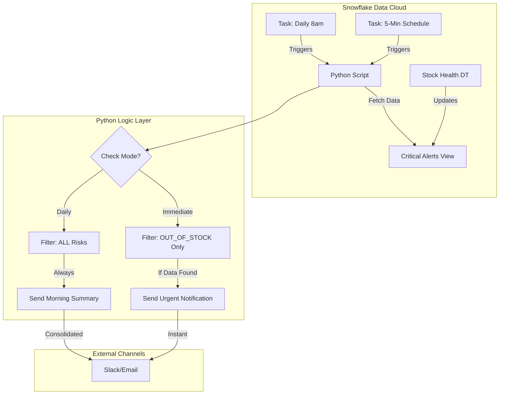

# 🧠 implementation Logic: Automatic Alert System

This document details the internal logic and architecture of the StockPulse 360 Automated Alert System.

---

## 1. Core Architecture Strategy: "Dual-Mode Scheduling"

To balance **responsiveness** (for emergencies) with **information overload** (for daily management), we devised a dual-mode execution strategy.

| Mode | Target Use Case | Trigger Frequency | Alert Types Covered |
| :--- | :--- | :--- | :--- |
| **Immediate** | 🚨 **Stockouts** (Emergency) | **Every 5 Minutes** | `OUT_OF_STOCK` only |
| **Daily** | 📊 **Morning Report** (Planning) | **Daily at 8:00 AM** | `CRITICAL`, `WARNING` |

### Why this approach?
1.  **Noise Reduction:** A warehouse manager doesn't need an email every 5 minutes saying "Stock is Low". They need that in a consolidated morning report.
2.  **Urgency:** If stocks hit ZERO, action is required *now*. Waiting for a daily report is unacceptable.
3.  **Cost Efficiency:** "Immediate" checks filter strictly for zero-stock items, keeping the payload small and processing fast.

---

## 2. Technical Components

### A. Snowflake Tasks (`sql/streams_tasks.sql`)

The heartbeat of the system relies on Snowflake Tasks to ensure 24/7 reliability without an external server.

```sql
-- 1. Immediate Task (Runs frequently)
CREATE TASK generate_critical_alerts
    SCHEDULE = '5 MINUTE' 
    -- Logic: Checks stock_health table for ANY critical conditions
    -- Note: We run this frequently, but the Python layer filters what to send.
```

### B. Python Logic Controller (`python/alert_sender.py`)

The script acts as the "Brain," deciding *what* to send based on the execution mode.

**Logic Flow:**
1.  **Input:** Accepts CLI argument `--mode [immediate|daily|all]`.
2.  **Fetch:** Queries `critical_alerts` view from Snowflake.
3.  **Filter:**
    *   If `mode == immediate`: Filter metadata where `status == 'OUT_OF_STOCK'`.
    *   If `mode == daily`: Select ALL `CRITICAL` and `WARNING` items.
4.  **Dispatch:**
    *   Iterates through filtered results.
    *   Sends to configured channels (Email/Slack).

**Code Snippet (Logic):**
```python
if args.mode == 'immediate':
    # Strict Filter: Only emergencies
    filtered_alerts = alerts[alerts['STOCK_STATUS'] == 'OUT_OF_STOCK']
    if not filtered_alerts.empty:
        send_alerts(filtered_alerts)

elif args.mode == 'daily':
    # Broad Scope: Full morning brief
    send_alerts(alerts) # Sends everything including warnings
```

---

## 3. Data Flow Diagram



---

## 4. Constraint Handling

*   **Duplicate Prevention:** 
    *   **SQL Layer:** The `insert` logic into `alert_log` checks `WHERE NOT EXISTS (SELECT 1 ... AND alert_date > 24 hours)`.
    *   **Effect:** Even if the 5-minute task runs 12 times an hour, it won't spam the database with duplicate alerts for the same item within 24 hours.

*   **Mixed Data Types:**
    *   **Problem:** Merging synthetic data with real data caused PyArrow crashes.
    *   **Fix:** Rigid type enforcement (`pd.to_datetime`) is applied *immediately* after any dataframe merge operation to ensuring stability.

---
**File Location:** `Guides/LOGIC_AUTOMATED_ALERTS.md`
