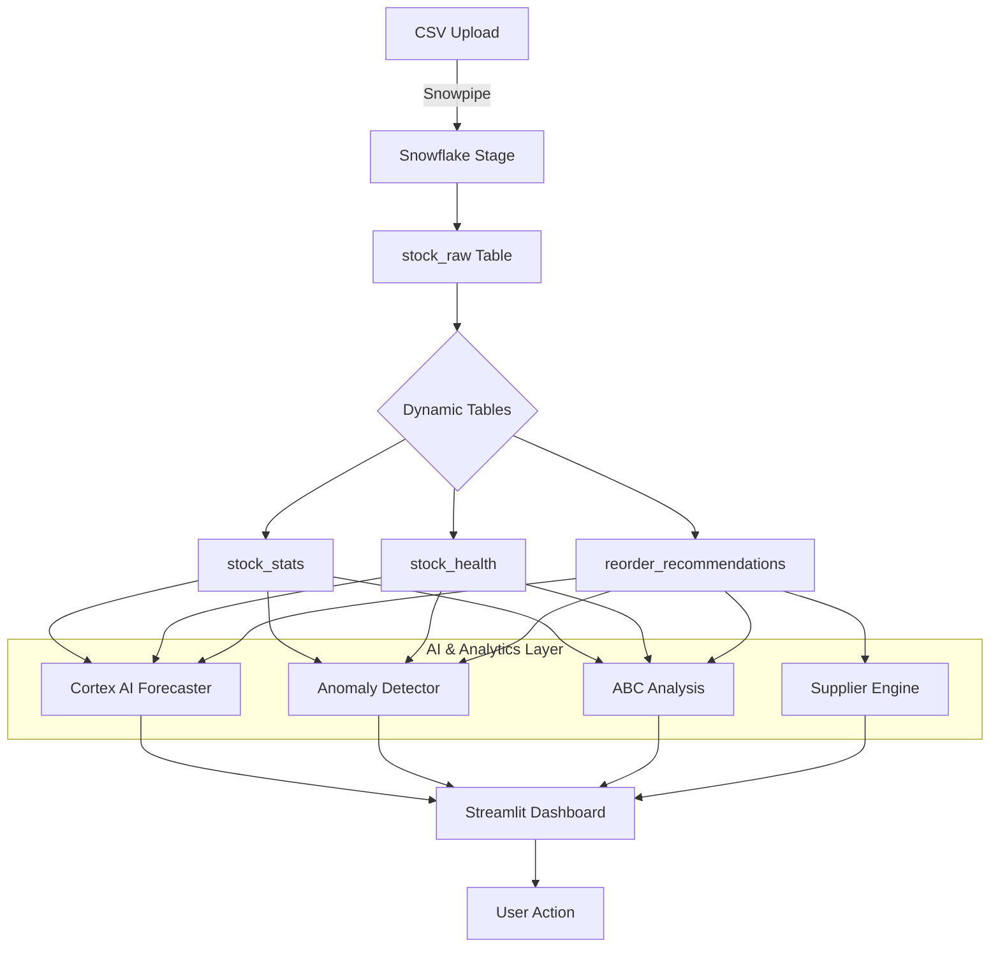

# ❄️ StockPulse 360

**AI-Driven Stock Health Monitor for Hospitals & Public Distribution Systems**

Built with **Snowflake** for the **AI for Good Hackathon** 🏆

---

## 🎯 Problem Statement

Hospitals, ration shops, and NGOs struggle with fragmented stock data across multiple systems, leading to:
- ❌ Stock-outs affecting patients and beneficiaries
- ❌ Food and medicine wastage
- ❌ Emergency orders and higher costs
- ❌ Lack of visibility into inventory health
- ❌ Inefficient supplier management

## 💡 Solution

StockPulse 360 is a comprehensive end-to-end solution providing:

### 🧠 Advanced AI/ML
- **Cortex AI Forecasting**: Native Snowflake ML for high-accuracy demand prediction
- **Anomaly Detection**: Identifies unusual usage patterns and potential theft
- **Seasonal Analysis**: Recognizes holiday spikes and seasonal trends

### 📊 Advanced Analytics
- **ABC Analysis**: Classifies inventory by value (High/Medium/Low)
- **Stockout Impact**: Quantifies patient/beneficiary impact of shortages
- **Cost Optimization**: Tracks budget, ROI, and identifies savings opportunities

### ⛓️ Supply Chain Automation
- **Supplier Integration**: Auto-selects best suppliers based on reliability & price
- **Smart Procurement**: Auto-generates purchase orders with delivery estimates
- **Performance Tracking**: Monitors supplier lead times and reliability scores

### ⚡ Core Features
- **Real-time Heatmap**: Visual stock health dashboard
- **Critical Alerts**: Instant notifications (Email/Slack)
- **One-Click Export**: Ready-to-use procurement lists

---

## 🏗️ Architecture



---

## 🛠️ Project Structure

```text
StockPulse 360/
│
├── data/                   # Sample stock data
├── Guides/                 # Detailed documentation
│   ├── AI_ML_FEATURES.md
│   ├── ADVANCED_ANALYTICS.md
│   ├── NOTIFICATION_SETUP.md
│   └── ...
│
├── sql/                    # Snowflake SQL Scripts
│   ├── create_tables.sql       # Base tables
│   ├── load_data.sql           # Data ingestion
│   ├── dynamic_tables.sql      # Auto-refresh metrics
│   ├── views.sql               # Core views
│   ├── streams_tasks.sql       # Automation
│   ├── ai_ml_views.sql         # AI/ML integration
│   ├── advanced_analytics.sql  # ABC & Cost analysis
│   └── supplier_integration.sql # Supplier management
│
├── python/                 # Python Modules
│   ├── cortex_ai_forecaster.py # Snowflake Cortex AI
│   ├── anomaly_detector.py     # Anomaly detection
│   ├── seasonal_forecaster.py  # Seasonal patterns
│   ├── alert_sender.py         # Notification system
│   └── ...
│
├── streamlit/
│   └── app.py              # Main dashboard application
│
└── requirements.txt        # Dependencies
```

---

## 🚀 Quick Start

### Prerequisites
1. **Snowflake Account**
2. **Python 3.8+**
3. **VS Code**

### Step 1: Set Up Snowflake
Run the SQL scripts in the `sql/` folder in this order:
1. `create_tables.sql`
2. `load_data.sql`
3. `dynamic_tables.sql`
4. `views.sql`
5. `streams_tasks.sql`
6. `ai_ml_views.sql`
7. `advanced_analytics.sql`
8. `supplier_integration.sql`

### Step 2: Configure Python
1. Install dependencies:
   ```bash
   pip install -r requirements.txt
   ```
2. Update `python/config.py` with your Snowflake credentials.

### Step 3: Run the Dashboard
```bash
streamlit run streamlit/app.py
```

---

## 📊 Dashboard Sections

### 1. **Overview & Heatmap**
- Real-time stock health visualization
- Key metrics (Stock-outs, Critical items, Value)

### 2. **AI/ML Insights**
- **Forecast Comparison**: Cortex AI vs Traditional models
- **Anomaly Dashboard**: Detected irregularities
- **Seasonal Trends**: Monthly and weekly patterns

### 3. **Advanced Analytics**
- **ABC Analysis**: Inventory classification
- **Cost Optimization**: Budget tracking & ROI
- **Stockout Impact**: Patient impact analysis

### 4. **Supplier Management**
- **Purchase Orders**: Auto-generated POs
- **Supplier Performance**: Reliability & Lead time tracking
- **Delivery Schedule**: Expected arrivals

---

## 🔄 Automated Workflows

| Task | Schedule | Purpose |
|------|----------|---------|
| `process_new_stock` | Hourly | Process new stock data |
| `generate_critical_alerts` | Every 30 mins | Generate alerts |
| `daily_summary_report` | Daily 8 AM | Summary report |
| `cleanup_old_alerts` | Weekly | Archive old alerts |

---

## 🎯 AI for Good Impact

- 🏥 **Hospitals**: Prevent life-saving drug shortages
- 🍚 **Ration Shops**: Optimize food distribution
- 🤝 **NGOs**: Maximize donor fund impact
- 🌍 **Sustainability**: Reduce waste through better forecasting

---

## 📄 License
MIT License - Built for AI for Good

---

**Made with ❤️ and ❄️ Snowflake**
